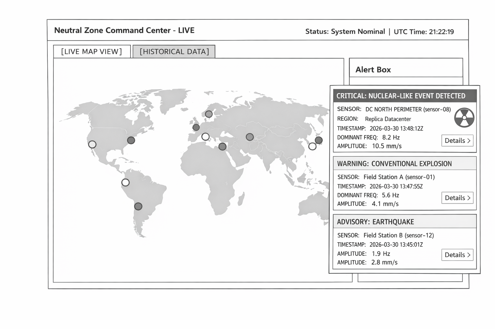
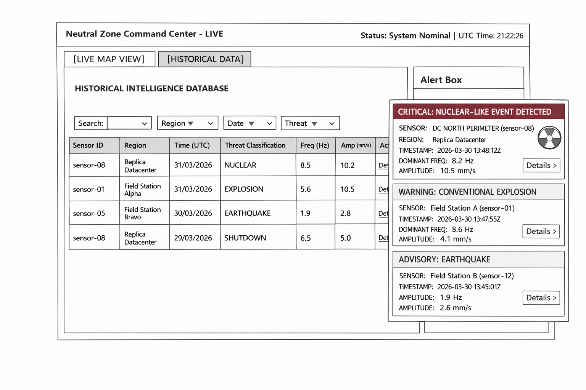

# System Description

The system is a distributed, fault-tolerant stream processing platform designed to provide operationally critical seismic intelligence. Set in a tense geopolitical landscape, the central routing components are hosted in a neutral region. This strict status mandates that the custom broker and gateway remain lightweight, exclusively fanning out raw measurements to active backend replicas without performing any direct data processing.

To achieve this, the system ingests real-time seismic signals from 12 geographically distributed sensors (both field stations and datacenter-hosted devices), performs frequency-domain analysis via FFT, and automatically classifies detected events into threat categories: earthquakes, conventional explosions, and nuclear-like events.

Because multiple replicas process the same broadcast stream concurrently, the platform utilizes a shared relational database equipped with unique constraints to guarantee duplicate-safe, idempotent event persistence.

Finally, an Intelligence Analyst interfaces with the platform via a real-time dashboard. Through a single gateway entry point, the analyst receives deduplicated, color-coded threat alerts via WebSocket or SSE, explores historical data, and filters intelligence by sensor or event type. The entire fully containerized architecture is reproducible and launches with a single `docker compose up` command.

# User Stories

## Real-time Monitoring

1. As an Intelligence Analyst, I want to see a real-time feed of newly detected seismic events on the dashboard, so that I am immediately aware of threats as they are classified.
2. As an Intelligence Analyst, I want each event in the real-time feed to display details such as the sensor name, event type, dominant frequency, magnitude, and detection time, so that I can quickly assess the nature and severity of the threat.
3. As an Intelligence Analyst, I want the real-time feed to visually distinguish event types by color (e.g., yellow for earthquake, orange for explosion, red for nuclear-like), so that I can identify critical threats at a glance.
4. As an Intelligence Analyst, I want the dashboard to update without requiring a manual page refresh, so that I never miss an event during monitoring.
5. As an Intelligence Analyst, I want to receive a prominent visual alert when a nuclear-like event is detected, so that the highest-priority threats are impossible to overlook.

## Historical Event Inspection

6. As an Intelligence Analyst, I want to view a paginated table of all historically detected events sorted by detection time (newest first), so that I can review past activity.
7. As an Intelligence Analyst, I want to filter the historical event table by event type (earthquake, conventional explosion, nuclear-like), so that I can focus on a specific threat category.
8. As an Intelligence Analyst, I want to filter the historical event table by sensor ID or sensor name, so that I can investigate activity at a specific location.
9. As an Intelligence Analyst, I want to filter the historical event table by region, so that I can narrow my analysis to a specific geographic area.
10. As an Intelligence Analyst, I want to filter the historical event table by a date/time range, so that I can investigate events that occurred during a specific period.
11. As an Intelligence Analyst, I want to click on a single event in the table to see its full details (all fields, including window timestamps, replica ID, and sensor coordinates), so that I can perform in-depth analysis.

## Sensors

12. As an Intelligence Analyst, I want to see a list of all available sensors with their name, category, region, and coordinates, so that I can understand the sensor network topology.
13. As an Intelligence Analyst, I want to see which sensors belong to the field category and which belong to the datacenter category, so that I can distinguish between remote surveillance stations and datacenter-hosted devices.
14. As an Intelligence Analyst, I want to see the geographic coordinates of each sensor on a map, so that I can understand the spatial distribution of the monitoring network.

## System Health and Fault Tolerance

15. As an Intelligence Analyst, I want to see the current status of each processing replica (alive or down), so that I know whether the system is operating at full capacity.
16. As an Intelligence Analyst, I want the dashboard to remain fully functional even when one or more processing replicas are down, so that intelligence delivery is never interrupted.
17. As an Intelligence Analyst, I want the system to automatically restart failed replicas and resume processing without manual intervention, so that the platform can self-heal after simulated failures.
18. As an Intelligence Analyst, I want the gateway to automatically route my requests only to healthy replicas, so that I never receive error responses due to a failed replica.

## Data Integrity

19. As an Intelligence Analyst, I want each event to appear exactly once in the historical table, even though multiple replicas may detect it simultaneously, so that the event record is clean and free of duplicates.
20. As an Intelligence Analyst, I want the system to persist events to the database immediately upon classification, so that no detected event is lost even if the detecting replica is shut down shortly afterward.

## Deployment

21. As a technician, I want to start the entire platform (simulator, broker, processing replicas, database, gateway, and dashboard) with a single `docker compose up` command, so that I can evaluate the system without manual setup steps.
22. As a technician, I want each service to have its own Dockerfile, so that the build process is transparent and reproducible on any machine.
23. As a technician, I want to be able to manually trigger a sensor event via the simulator's admin API and see it appear on the dashboard within seconds, so that I can verify that the end-to-end pipeline works correctly.
24. As a technician, I want to be able to manually trigger a shutdown command and observe that the affected replica terminates and restarts while the dashboard continues working, so that I can verify fault tolerance.

# LoFi Mockups

## Live Map View

## Historical Data View
